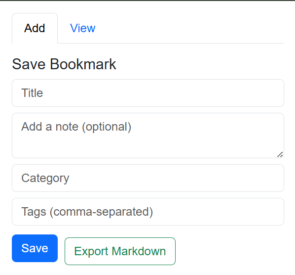
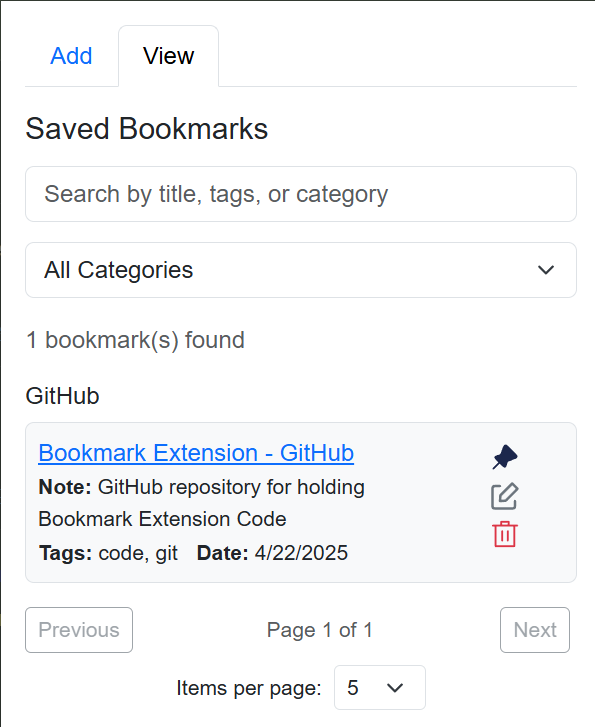

# Smart Bookmark Exporter

A lightweight Chrome Extension that allows you to bookmark the current webpage with **categories** and **tags**, then export all your saved bookmarks in **Markdown format**—perfect for use in **Obsidian**, **Notion**, and other markdown-based tools.

## Features

- **Save bookmarks** with title, URL, category, and tags
- **Add notes** to your bookmarks for additional context
- **Pin important bookmarks** to keep them at the top of your list
- **View and manage** all your saved bookmarks in one place
- **Search and filter** bookmarks by title, category, or tags
- **Edit or delete** existing bookmarks
- **Pagination** for easy navigation through large bookmark collections
- **Export all bookmarks** as a well-structured Markdown file
- **Fully compatible** with markdown editors like Obsidian and Notion
- **Lightweight** with minimal permissions required
- **Local storage** keeps your bookmarks private and secure

## Preview




## Installation

1. Clone or download this repository.
2. Go to `chrome://extensions/` in your Chrome browser.
3. Enable **Developer Mode** (toggle in the top-right).
4. Click **Load Unpacked** and select the project folder.
5. Pin the extension to your toolbar and start bookmarking!

## Usage

### Adding Bookmarks

1. Navigate to any webpage you want to save.
2. Click the extension icon in your toolbar.
3. Fill in:
   - **Title** (auto-filled with the page title)
   - **Notes** (optional additional context)
   - **Category** (e.g., Productivity, Inspiration)
   - **Tags** (comma-separated, e.g., AI, Tools)
4. Click **Save**.

### Managing Bookmarks

1. Click the extension icon and navigate to the **View** tab.
2. From here you can:
   - **Search** bookmarks by title, category, or tags
   - **Filter** by category using the dropdown
   - **Pin/Unpin** important bookmarks
   - **Edit** existing bookmarks
   - **Delete** bookmarks you no longer need
   - Adjust **items per page** for pagination

### Exporting Bookmarks

1. Click the extension icon.
2. Click **Export Markdown** button.
3. The extension will generate a Markdown file with all your bookmarks organized by category.
4. The file will be automatically downloaded to your computer.

## Export Format (Markdown Example)

```markdown
# Bookmarks Export

## Productivity

- [ChatGPT - OpenAI](https://chat.openai.com)
  - Tags: AI, Tools
  - Date: 04/22/2025

## Learning

- [MDN Web Docs](https://developer.mozilla.org)
  - Tags: Web Development, Reference
  - Date: 04/22/2025
```

## Privacy

All bookmarks are stored locally in your browser using Chrome's storage API. No data is sent to external servers.

## License

This project is open source and available for anyone to use and modify.
